# NeetCodeAnki
The entire NeetCode150 Roadmap in [Anki SRS](https://apps.ankiweb.net/) with each topic as a subdeck. Flashcards and decks are in order with V3 Scheduling enabled and LowKey Anki settings. Courtesy to [ayorgo](https://github.com/ayorgo/) for scraping this deck, original deck <sup>[[1]](#1)</sup> and settings are in his [repo](https://github.com/ayorgo/leetcode-neetcode-anki). There are Regular Cards (cards for questions without needing LeetCode Premium), and Premium Cards (cards for questions that require LeetCode normally, but is bypassed through [LintCode](https://www.lintcode.com))

## How to Use
* Install Anki and do research about SRS (likely on youtube) and what it is. (Check out [ncase](https://ncase.me/remember/) to learn about SRS)
* After having made an ankiweb account and Anki profile, download the NeetCode150.apkg and run it, it will automatically install into Anki.
* Download deck and import into Anki.
* Install add-ons and copy settings over if they aren't fully copied from below.
* Only use Good or Again (pass/fail) if you want to use LowKey Anki settings (recommended).
* If you are a beginner, the deck moves in order on the NeetCode roadmap. The order is listed down below. Study 1-2 Data Structures at a time until you get to the next data structure on the deck.
* Study daily and finish reviews and new cards as given. (You may set new cards/day to 1 or 2 if its too overwhelming at first to build the habit).

* Note: I would recommend studying youtube videos in your programming language for the current new section you are studying, and the next one. If you want you may also study the previous section concurrently. Never study more than 3 data structures at a time, so as to not overwhelm yourself. Anki handles the pattern recognition and review for you mainly.

## Regular Card Structure
Front                            |Hint                           |Back
:-------------------------------:|:-----------------------------:|:-----------------------------:
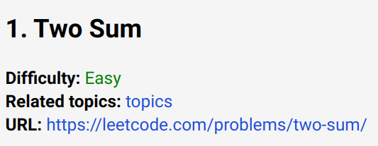|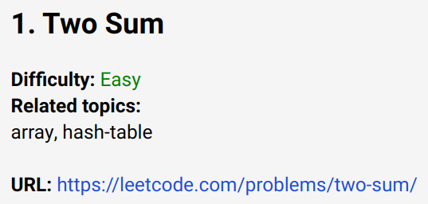|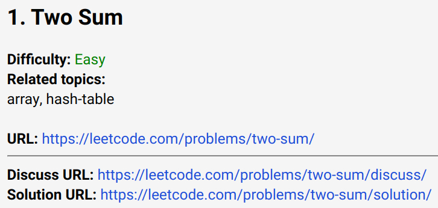

Each regular (unpaid) card contains the following fields:
* title
* id
* slug
* difficulty
* topics
* paid
* NeetCode URL

Each premium (paid) card contains the following fields. Premium cards automatically have the bypass link to [LintCode](https://www.lintcode.com):
* title
* id
* difficulty
* topics
* paid
* NeetCode URL

## Deck structure
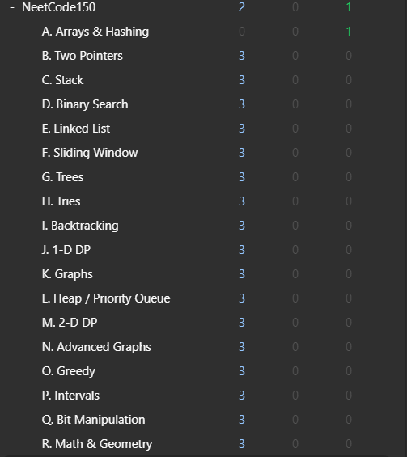

## Anki Settings
### Preferences
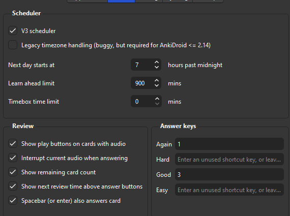

Note: Make sure "hard" and "easy" are not binded to a key if you are using LowKey Anki (recommended).

### Add-ons


Here is where you can get these add-ons:
* [Edit Field During Review Cloze](https://ankiweb.net/shared/info/385888438). This will allow you to edit your cards while studying in case you need to add a NeetCode video solution.
* [More Overview Stats 2.1](https://ankiweb.net/shared/info/738807903). This gives you more overview stats under the stats section of Anki.
* [PassFail 2](https://ankiweb.net/shared/info/876946123). This is a critical add-on as it is necessary for LowKey Anki (the settings this deck brings), and review scheduling.
* [Review Heatmap](https://ankiweb.net/shared/info/1771074083). A nice add-on to see your reviews visually, and how much many cards you have reviewed each day. Very motivating IMO.

## Deck Settings
### Scheduling
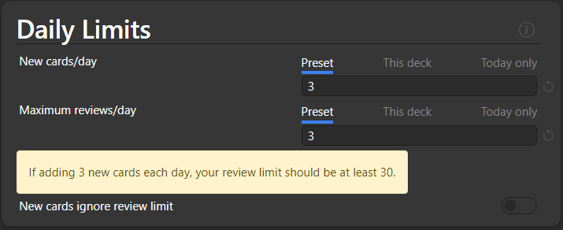
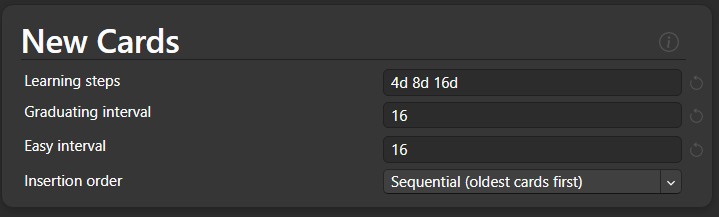

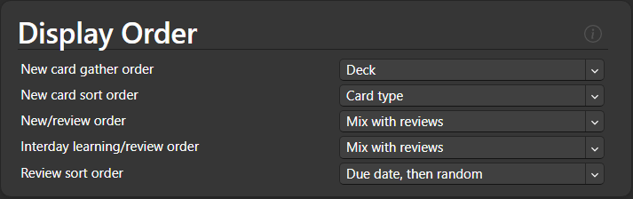

### Burying, Timer, Audio
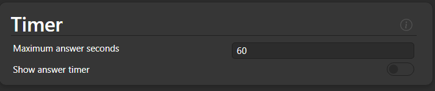
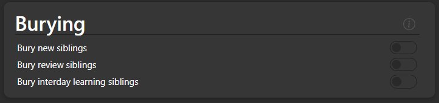
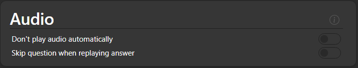

### Advanced
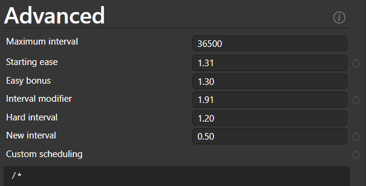

Here is the script for the advanced settings if it isn't already there. Taken from <sup>[[2]](#2)</sup> for Lowkey Anki.
```
/*
 * New card:
 * 	Fail: enter the learning sequence.
 * 	Pass: skip the learning sequence and use the ‘easy interval’ setting.
 */
if (states.current.normal?.new ||
        states.current.filtered?.rescheduling.originalState.new) {
        states.hard = states.easy;
        states.good = states.easy;
}

/*
 * (Re)learning card:
 * 	Fail: reset the (re)learning sequence.
 * 	Pass: progress in the (re)learning sequence.
 */
else if (states.current.normal?.learning ||
        states.current.normal?.relearning ||
        states.current.filtered?.rescheduling.originalState.learning ||
        states.current.filtered?.rescheduling.originalState.relearning) {
        states.hard = states.good;
        states.easy = states.good;
}

/*
 * Review card:
 * 	Fail: enter the relearning sequence with no penalty.
 * 	Pass: multiply the interval by the constant ease factor.
*/
// Code for normal review
else if (states.current.normal?.review) {
        states.hard = states.good;
        states.easy = states.good;
        states.again.normal.relearning.review.easeFactor =
                states.current.normal.review.easeFactor;
}
// Code for filtered decks
else if (states.current.filtered?.rescheduling.originalState.review) {
        states.hard = states.good;
        states.easy = states.good;
        states.again.filtered.rescheduling.originalState.relearning.review.easeFactor =
                states.current.filtered.rescheduling.originalState.review.easeFactor;
}
```

## [NeetCode roadmap](https://neetcode.io/roadmap)
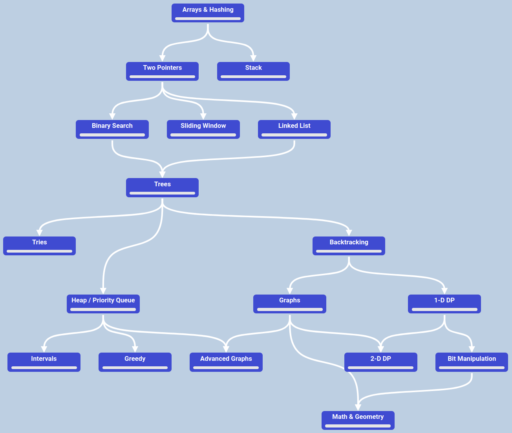

## References
* <sup><a id="1">[1]</a></sup> The flashcards were originally generated by [ayorgo](https://github.com/ayorgo/leetcode-neetcode-anki).
* <sup><a id="2">[2]</a></sup> Digital Worlds created this [script](https://digitalwords.net/anki/low-key/) specifically for LowKey Anki.
